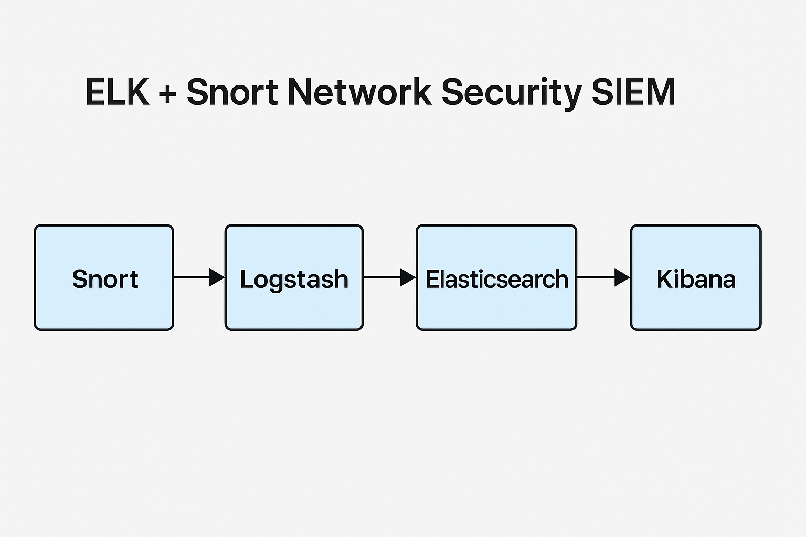

# ELK + Snort Network Security SIEM

This project integrates Snort with the ELK Stack (Elasticsearch, Logstash, Kibana) to create a lightweight, customizable SIEM solution for detecting and visualizing network threats.

## Features
- Real-time alerting from Snort IDS
- Centralized log parsing via Logstash
- Kibana dashboards for threat visibility
- Extensible and open-source

## Stack Components
- **Snort**: Network IDS to generate alerts
- **Logstash**: Parses and forwards Snort logs
- **Elasticsearch**: Indexes and stores logs
- **Kibana**: Visualizes alerts and events

## Setup (High-Level)
1. Run Snort to capture and log network alerts.
2. Configure Logstash to read `alert_fast.txt` and parse it.
3. Send parsed events to Elasticsearch.
4. Use Kibana to explore and visualize.

See [docs/setup-guide.md](docs/setup-guide.md) for full steps.

## Sample Dashboard

## Sample Logs
See `sample-logs/alert_fast.txt` for sample alerts and test traffic.

## Future Plans
- Add Wazuh or OSSEC agent integration
- Enable alerting via email or Slack

##  Author
[Chinkhuselts](https://github.com/Chinkhuselts)
