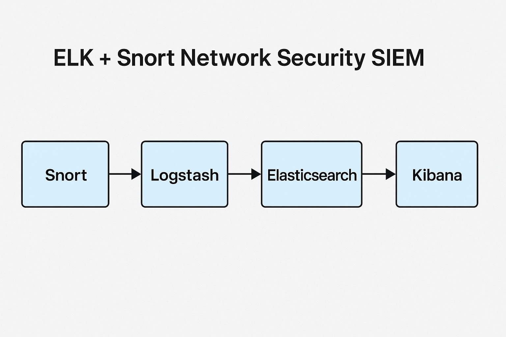
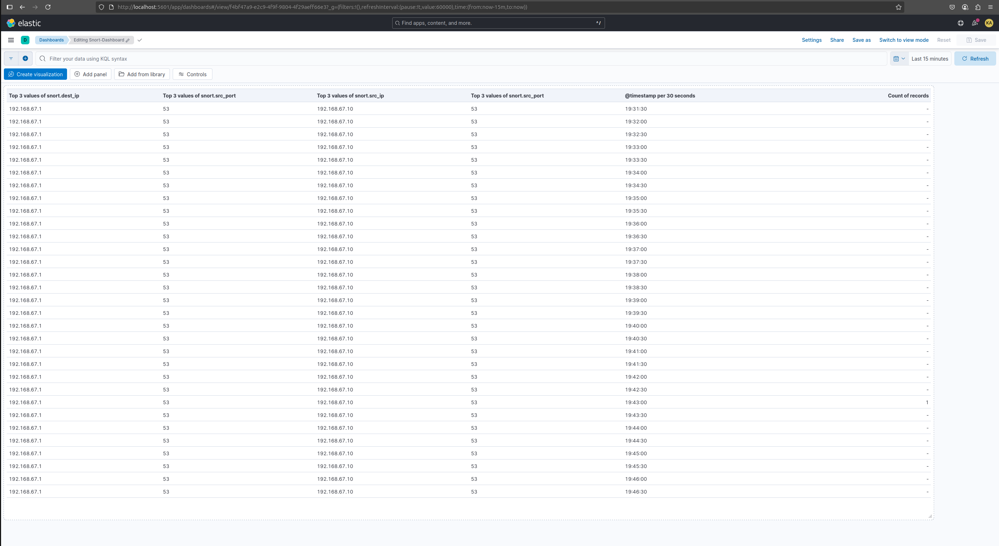

# ELK + Snort Network Security SIEM

This repository provides a lightweight, customizable Security Information and Event Management (SIEM) solution by integrating the Snort Intrusion Detection System (IDS) with the ELK Stack (Elasticsearch, Logstash, and Kibana). This project is designed to actively detect, process, and visualize network threats in a centralized environment.

## Features
* **Real-Time Alerting:** Captures and evaluates network events actively using Snort IDS.
* **Centralized Log Management:** Utilizes Logstash for robust log parsing and secure forwarding.
* **Advanced Threat Visibility:** Leverages Kibana dashboards for comprehensive event visualization and analysis.
* **Open-Source & Extensible:** Built entirely on open-source technologies, allowing for flexible scaling and integration.

## Stack Components
* **Snort:** Network IDS responsible for analyzing traffic signatures and generating security alerts.
* **Logstash:** Ingests the Snort log files, formats the data, and acts as the delivery pipeline.
* **Elasticsearch:** Acts as the core search and analytics engine, indexing and securely storing the parsed logs.
* **Kibana:** Provides the graphical web interface for exploring data, searching logs, and visualizing security events.

## Setup and Installation
1. Initialize **Snort** to capture network traffic and generate alert logs.
2. Configure **Logstash** to read and systematically parse the outputted `alert_fast.txt` file.
3. Forward the parsed event data into **Elasticsearch** for indexing.
4. Access **Kibana** to explore, analyze, and visualize the threat data.

For complete installation and configuration instructions, please refer to the primary setup documentation: [docs/SETUP.md](docs/SETUP.md).

## Architecture & Visualization

## Sample Data
To test the log parsing pipeline and Kibana visual analytics without live network traffic, sample alerts and test payloads are provided within `sample-logs/alert_fast.txt`.

## Future Roadmap
* Integrate Wazuh or OSSEC agents for comprehensive host-based intrusion detection capabilities.
* Implement automated alerting mechanisms via email and Slack webhooks for immediate incident response.

## Author
**Chinkhusel Tsolmonbaatar** ([@Chinkhuselts](https://github.com/Chinkhuselts))
